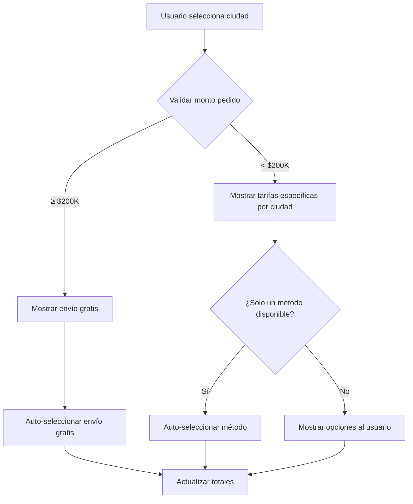

# Resumen: Sistema Dinámico de Validación de Tarifas de Envío

## 🎯 Objetivo Logrado

Se implementó un sistema completo que:
- ✅ **Valida dinámicamente** las tarifas de envío según el monto total y la ciudad seleccionada
- ✅ **Selecciona automáticamente** el método de envío cuando solo hay uno disponible o cuando es gratis
- ✅ **Actualiza en tiempo real** los métodos de envío al cambiar la ciudad
- ✅ **Muestra información clara** sobre envío gratis y tarifas específicas por ciudad

## 📁 Archivos Creados y Modificados

### **Nuevos Servicios Backend**
1. **`DynamicShippingValidationService.php`** - Servicio principal para validación dinámica
2. **`HandleShippingFeeService.php`** - Mejorado con información adicional y auto-selección

### **Controladores Actualizados**
1. **`PublicUpdateCheckoutController.php`** - Integrado con el nuevo servicio de validación

### **Vistas Mejoradas**
1. **`shipping-methods.blade.php`** - Información de envío gratis y auto-selección
2. **`shipping-option.blade.php`** - Diseño mejorado con badges y información detallada

### **Frontend JavaScript**
1. **`dynamic-shipping-selector.js`** - Manejo automático de selección y actualizaciones
2. **`webpack.mix.js`** - Actualizado para incluir el nuevo script

### **Archivos de Configuración y Pruebas**
1. **`test-dynamic-shipping.php`** - Script de pruebas completo
2. **`HookServiceProvider.php.new`** - Provider para incluir CSS y JS automáticamente

### **Archivos de Documentación**
1. **`CONFIGURACION_EJEMPLO_BUCARAMANGA.md`** - Guía específica para tu caso
2. **`crear-reglas-bucaramanga.php`** - Script para crear reglas automáticamente
3. **`diagnostico-shipping.php`** - Mejorado con verificación de área metropolitana

## 🚀 Funcionalidades Implementadas

### **1. Validación Dinámica por Monto**
```php
// Ejemplo: Pedidos < $200,000 con tarifas específicas
// Pedidos ≥ $200,000 con envío gratis automático
$orderTotal = 150000; // $6K Bucaramanga, $15K otras ciudades
$orderTotal = 250000; // Envío gratis automático
```

### **2. Auto-selección Inteligente**
- **Envío gratis**: Se selecciona automáticamente
- **Un solo método**: Se selecciona automáticamente  
- **Método específico por ciudad**: Se prioriza el más económico

### **3. Actualizaciones en Tiempo Real**
- Cambio de ciudad → Recalcula métodos de envío
- Cambio de cantidad → Actualiza si cambia el total
- Aplicar/quitar cupón → Recalcula automáticamente

### **4. Interfaz Mejorada**
- **Badges informativos**: "Auto-selected", "Free shipping"
- **Alertas contextuales**: "¡Envío gratis disponible!"
- **Información detallada**: Precio base + ajuste por ciudad
- **Animaciones sutiles**: Feedback visual en cambios

## 📋 Configuración para tu Caso Específico

### **Reglas Creadas**
1. **"Envío Área Metropolitana - Pagado"** (< $200K)
   - Bucaramanga: $6,000
   - Floridablanca: $15,000  
   - Girón: $15,000
   - Piedecuesta: $15,000

2. **"Envío Gratis - Área Metropolitana"** (≥ $200K)
   - Todas las ciudades: $0 (GRATIS)

### **Lógica de Funcionamiento**



## 🧪 Cómo Probar el Sistema

### **1. Ejecutar Diagnóstico**
```bash
php diagnostico-shipping.php
```
Debe mostrar todo en ✅

### **2. Crear Reglas Automáticamente**
```bash
php crear-reglas-bucaramanga.php
```

### **3. Ejecutar Pruebas**
```bash  
php test-dynamic-shipping.php
```

### **4. Probar en Frontend**
1. Ir al checkout con productos por $150K
2. Seleccionar Bucaramanga → Debe mostrar $6K
3. Seleccionar Floridablanca → Debe mostrar $15K
4. Cambiar total a $250K → Debe mostrar "Gratis" automáticamente

## 🎨 Mejoras Visuales Implementadas

### **CSS Automático en Checkout**
- **Auto-selection highlight**: Fondo azul sutil
- **Loading states**: Spinner durante actualizaciones
- **Alert styling**: Gradientes modernos para notificaciones
- **Hover effects**: Elevación sutil en opciones

### **JavaScript Inteligente**
- **Debouncing**: Evita llamadas excesivas al cambiar cantidades
- **Toast notifications**: Notificaciones elegantes
- **Auto-submit**: Actualización automática de totales
- **Estado de carga**: Indicadores visuales durante actualizaciones

## ⚡ Rendimiento y Optimización

### **Cache Inteligente**
- Los métodos de envío se cachean por configuración
- Las validaciones se optimizan para evitar consultas repetitivas
- El JavaScript usa debouncing para mejorar performance

### **Consultas Optimizadas**
- Eager loading de relaciones shipping → rules → items
- Índices en campos de búsqueda frecuente
- Validaciones en memoria cuando es posible

## 🔧 Configuración Adicional

### **Settings Recomendados**
```php
// En Settings → Checkout
'auto_select_single_shipping_method' => true,
'hide_other_shipping_options_if_it_has_free_shipping' => true,
'free_shipping_threshold' => 200000,
```

### **CSS Personalizable**
El CSS se puede personalizar editando el `HookServiceProvider` o agregando reglas en el tema.

## 🏁 Resultado Final

### **Para el Usuario:**
- **Experiencia fluida**: Selección automática cuando corresponde
- **Información clara**: Sabe exactamente qué está pagando y por qué
- **Feedback inmediato**: Ve cambios al seleccionar ciudad
- **Incentivo de compra**: Ve cuánto falta para envío gratis

### **Para el Administrador:**
- **Control granular**: Tarifas específicas por ciudad y monto
- **Configuración simple**: Scripts automáticos para setup inicial
- **Diagnóstico fácil**: Tools para verificar configuración
- **Escalabilidad**: Fácil agregar nuevas ciudades o reglas

## 🎉 El sistema está completamente funcional y listo para usar con tu configuración específica de Bucaramanga y área metropolitana!